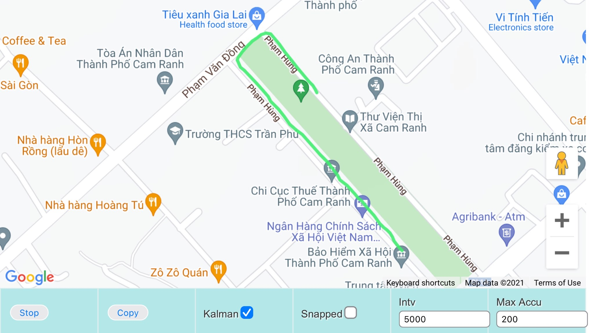
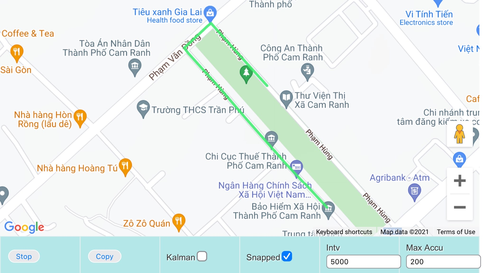

## kalman-filter-gps

Target workout activity with various mode:
- Standing
- Walking
- Trekking
- Running
- Biking
- Auto detect and filter out when not moving.
- Filter out bad accuracy data.
- Draw poly line with Google Map. All in js
### v.0.2.0
- Add Google Snap To Road Service.

### Demo
#### Raw Data

#### Kalman Filter - Walking mode

#### Google Road API: Snap To Road - Interpolation = True

#### Live Sample
<https://quanghuynhthanh.github.io/kalman-filter-gps/demo.html>